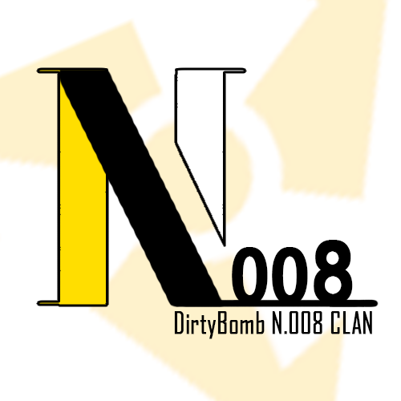

# __Title : README MarkDown Example__ (bold)

## 1. Letter Transformation
 - read me.. carefully, please! this is MarkDown
 - <b>Bold</b> or __Bold__
 - <i>Italic</i>  or _Italic_
 - <strike>Strike</strike> : no use for strike in MD.

## 2. Title, HERE
 - <h1>H1 TITLE is Here</h1>
> If want to use code = HIT! 4 TABS
         def triangle(tree_leaf_end, tree_base_width):
             for x in range(1,tree_leaf_end+1, 2):
                 print(("*"*x).center(tree_base_width))
>         
         def trapezoid(tree_leaf_start, tree_leaf_end, tree_base_width):
             for x in range(tree_leaf_start, tree_leaf_end+1, 2):
                 print(("*"*x).center(tree_base_width))    

## 3. __The ASIA DB Clan__

 -  __THE__ THE _THE_
 - _lalalalalalalalalalalala......_

 [SHOW TEXT: Hyper Reference](https//unins.github.io)
> ## _ __Dirty BOMB N.008 CLAN__ _
>
<table>
  <tr>
    <td>
     
    </td>
  </tr>  
  <tr>
    <td>
     fig.1 -- DB N.008 Clan Image
    </td>
  </tr>
</table>
> <a href="http://steamcommunity.com/groups/dbn008">Clan site</a>
or... [Clan site](http://steamcommunity.com/groups/dbn008)  .. like this!
